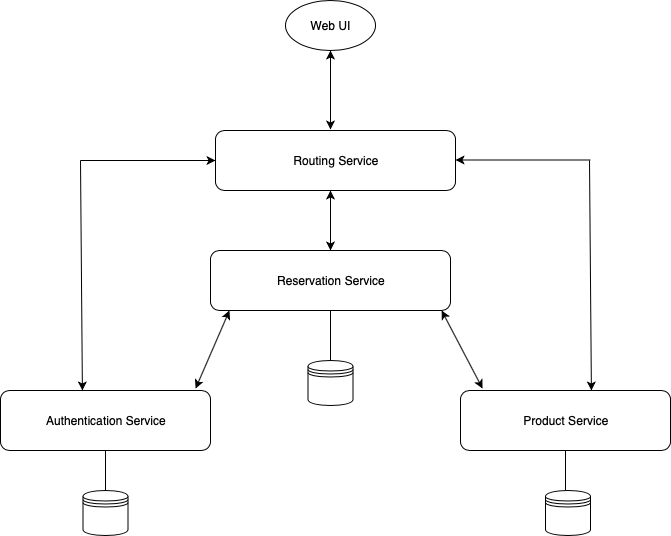

# Reservation Service

Reservation Service project of Service-Oriented Programming Class, Information Technology, King Mongkut's Institute of Technolgoy Ladkrabang.

## What is Reservation Service ?

Reservation Service is a service that would grant you an ability to queue or make a reservation for you on a specific shop. Queue ahead, then receive goods or service on time. No need to waste time waiting at the spot.

## Why Reservation Service ?

Have you ever went to your favorite restaurant, barber shop or beauty salon and wait so long? When you thought 20 minutes of time is enough, but it results in 2 hours, which mostly is wasted on waiting. What if you can just queue or make a reservation ahead, then receive goods or service on time. Save more time to do other things than waiting. In addition, there is no need worrying in the goods out of stock.

## Features

### Sign Up and Login

Before using our service, an account is needed. Once you have created your account, you will be able to freely use the service. Users can sign up as either a customer or a shop owner.

### View Shop Information

Customers can view shop information before making a queue or reservation.

### Manage Own Queues and Reservations

Main feature of the service. Customers can make, view and cancel queues and reservations. Starting by choosing the shop, select product or service, choose the time, fill other needed information and done! If you think you have made any mistakes, you can cancel the queue any time before the queue or reservation is due, or cancel before a certain duration according to the shop policy.

Please be aware that if the queue or reservation is falsely made, which means no products or services are actually served accoring to the queue or reservation may result in a penalty.

### Set Up Your Shop

As for shop owners, managers and staffs, they can set up the shop in our service for customers to make queues and reservations. Setting up a shop need a following information: shop name, shop type, shop summary, shop opening date & time and shop image. More advanced information and list of products or services can be added later.

### Manage Product or Service List

Shops are not able to run if there is no product or service. Shop owners, managers and staffs are able to manage this list, including add, view, update and delete items. All of them are basic operations of list management.

### Manage Queues and Reservations of Customers

After the shop is fully set up, customers can now use the Reservation Service of your shop. After a customer chose a certain product or service to make a queue or reservation, you will be able to see the one customer made. The rest is up to you how you would like to manage these queues and reservations.

### Comment

Customers can comment on a certain shop, basically a review.

## Conceptual Diagram

## Service API End-Points

- [Authentication Service](README-auth.md)
- [User Management Service](README-user.md)
- [Reservation Service](README-reservation.md)
- [Product Service](README-product.md)
- [Shop Service](README-shop.md)
- [Comment Service](README-comment.md)

## Team

|||||
|:---:|:---:|:---:|:---:|
|[810Teams](https://github.com/810Teams)|[Punmanat](https://github.com/Punmanat)|[Narongded](https://github.com/Narongded)|[prachyaprapawat](https://github.com/prachyaprapawat)|
|Teerapat Kraisrisirikul|Punmanat Nantasanti|Narongded Pinprechachai|Prachya Prapawat|
|60070183|60070053|60070046|60070023|

